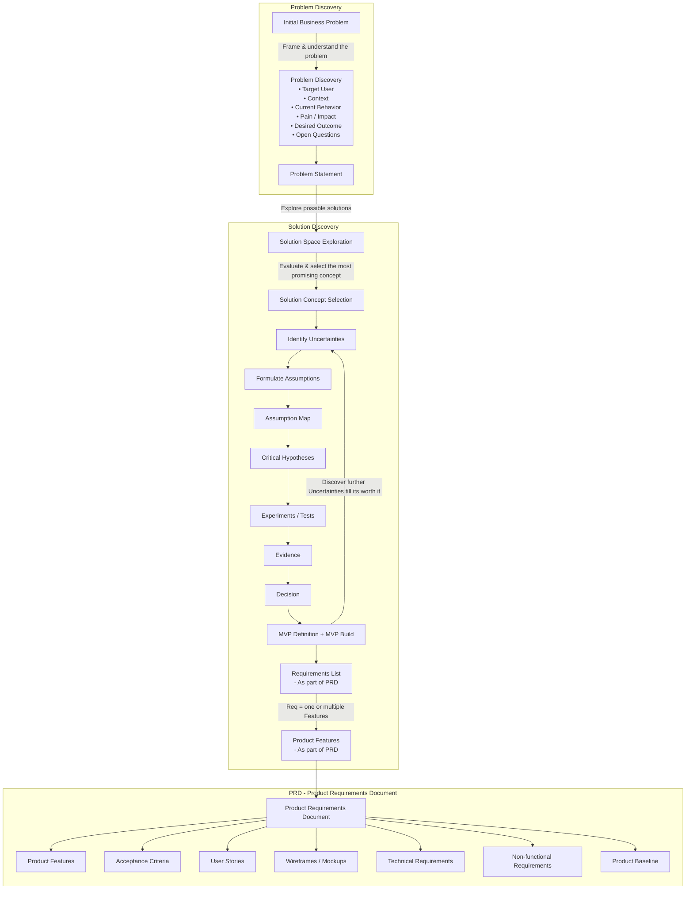

- [ ] Update templates from actuals e.g. `ART-002-assumption-list.md` to `ART-XXX-assumption-list.md`.
- [ ] remove pull request templates and folder & add one general template for all PRs
- [ ] add a new issue template for discovery work items
- [ ] add copilot instruction to .github/
- [ ] add into docs/01_product/02_discovery/01_product/ file structure
   - [ ] artifacts + .gitkeep
   - [ ] assumptions + .gitkeep
   - [ ] business-problem + .gitkeep
   - [ ] decisions + .gitkeep
   - [ ] experiments + .gitkeep
   - [ ] templates
      - [ ] ensure to copy all templates to this folder
- [ ] update docs/01_product/02_discovery/01_product/product-discovery-minimum-guide.md
- [ ] update .github/ISSUE_TEMPLATE/issue-discovery.md. It should state that the goal is to create  artifact `business-problem.md` no others.
- [ ] add to .github/ISSUE_TEMPLATE/issue-discovery.md, to use `problem-discovery-guide-simple.md` as reference for further discovery steps. 
- [ ] CI + script for converting ODS to CSV for GH display + traceability has been added. Check if excluded paths are correct when moving to another repository.
- [ ] move `ToDoList.md` mermaid chart to instruction.
- [ ] remove `ToDoList.md` 

==========================================

