# Low-Fidelity Wireframe Log

## Purpose
The purpose of this document is to provide a log of the low-fidelity wireframes created for the product. This log will help track the progress of the wireframe development and provide a reference for future design decisions. Design source of truth is kept in Figma file `lo-fi_wireframe-[name].fig` in the `docs/product/architecture/ui/lo-fi_wireframe` directory.

The Figma file type `.fig` is not git diffable, so this log will serve as a record of the wireframe development process.
For `.fig` file, the git `LFS` (Large File Storage) is used to store the file in the git repository. The `.gitattributes` file is configured to track `.fig` files with `git-lfs`.

**Template address:** `docs/product/architecture/templates/ui/lo-fi_wireframe-[name]-[template]_v0.0.0.fig` 
**Log Address:** `docs/product/architecture/ui/lo-fi_wireframe/lo-fi_wireframe-log.md` 

## Process Flow

**Prerequisite:** git LFS is installed and configured in the local git repository.

```mermaid
flowchart LR
    subgraph Initialization 
        direction LR
        A[Open Figma] --> B["Load file<br> lo-fi_wireframe-[name]-[template]_v0.0.0.fig"]
        B --> C[Make changes to the wireframe]
        C --> D[1. Update .fig revision number<br>2. Save local copy<br>3. Copy file to project directory]
        D --> E[Update log file]
        E --> F[Commit changes to git repository]
    end
    subgraph Regular-Update
        direction LR
        G[Open Figma] --> H[Load file from project directory]
        H --> I[Make changes to the wireframe]
        I --> J[1. Update .fig revision number<br>2. Save local copy<br>3. Copy file to project directory]
        J --> K[Update log file]
        K --> L[Commit changes to git repository]
    end
    
    %% link the two subgraphs
    F --> G
```

## Log
| Date | Wireframe Version | Change Description | Related Decision |Change Owner |
|------|----------------|-------------|------------|-------|    
| 2026-07-01 | v1.1.0 | [EXS-003-experiment](../../../discovery/experiments/EXP-003-quick-action-location/EXS-003-experiment-simple.md) Quick Action Location Validation | [EXS-003-experiment](../../../discovery/experiments/EXP-003-quick-action-location/EXS-003-experiment-simple.md#decision) - Decision | John Doe |