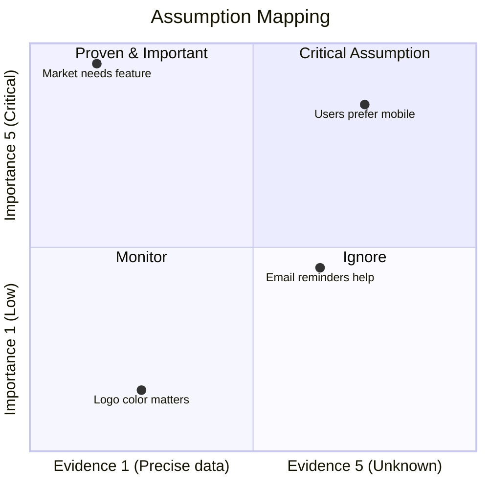

# Assumptions List

## Purpose
The purpose of this document is to capture all currently known product uncertainties and their associated assumptions and translate them into a `Assumption List` and `Assumption Mapping` to help prioritize the assumptions and identify the riskiest assumptions to focus on first.

## Assumption List

**Types to cover:**
- Desirability (Market, Users)
- Feasibility (Technology, Resources)
- Viability (Business Model, Revenue Streams)

**Uncertainty:**> 
`What we dont know?`

**Uncertainties --> Assumptions:** 
`What is our current belief (assumption) on this uncertainty?`

| Uncertainty ID | Type | Description | Importance Level | Evidence Level | Belief (Assumption) | Assumption ID |
| --- | --- | --- | --- | --- | --- | -- |
| UNC-002 | User | We don't know whether users prefer email notifications or in-app notifications. | 4 | 4 | We believe users prefer email notifications because they check their email more frequently than they open the application. | AS-001
| UNC-002 | User | We don't know whether users prefer email notifications or in-app notifications. | 4 | 4 | We believe users prefer in-app notifications because they ignore marketing emails. | AS-002 | 
| UNC-002 | User | We don't know whether users prefer email notifications or in-app notifications. | 4 | 4 | We believe users have no strong preference as long as notifications are timely. | AS-003 |

## Assumption Mapping
Visualize with a quadrant chart to help prioritize the uncertainties.
`belief(Assumption)` + `evidence` + `importance` = `assumption mapping(prioritization)` 

Scoring:
- Importance Level:              
  - 1 - Low
  - 2 - Nice to have
  - 3 - Useful
  - 4 - Important
  - 5 - Critical
- Evidence Level:
  - 1 - Precise data
  - 2 - Limited data
  - 3 - Occasional data
  - 4 - None 
  - 5 - Unknown 

## References
- [Problem Discovery Guide Simple](../product-discovery-guide-simple.md)
- Issue #19
- PR #20

## Next Steps
1. Translate the `Critical Assumptions` into `Assumption Backlog` and prioritize them in artifact `assumption-backlog.md` to focus on the riskiest assumptions first.