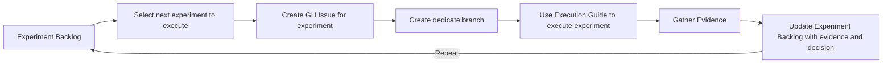

# Experiments Backlog

## Purpose
- **1)** The purpose of this document is to capture the experiments backlog for the product discovery process. It serves as a central repository for all experiments that are planned, in progress, or completed.

- **2)** It serve as simple execution guide for experiments

## ToC:
1. [Backlog](#1-backlog)
2. [Execution Guide](#2-execution-guide) 
2.1 [Execution Flow](#21-execution-flow) 
2.2 [Hypothesis Creation Rules](#22-hypothesis-creation-rules) 
2.3 [Experiment Creation Rules](#23-experiment-creation-rules) 
2.4 [Evidence Gathering Rules](#24-evidence-gathering-rules) 

## 1. Backlog

| Priority | Assumption ID | Hypothesis | Experiment | Evidence | Decision | Owner| Status | Start Date | Completion Date |
| --- | --- | --- | --- | --- | --- | --- | --- | --- | --- |
| 1 | Assumption 1 | If we implement feature X, then user engagement will increase by 20% | A/B testing of feature X vs. control group | Collected data from A/B test | Decision pending | John Doe | In Progress | 2024-06-01 | 2024-06-15 |

## 2. Execution Guide

### 2.1 Execution Flow

### 2.2 Hypothesis Creation Rules
- To create a hypothesis, use the following formula: 
`Hypothesis = Assumption + Expected Outcome + Rationale`, hypothesis makes the assumption testable and measurable.

- Hypothesis `does not require standalone artifact` if the assumption is simple and can be tested with a single experiment. However, if the assumption is complex and requires multiple experiments to test, then it is recommended to create a separate hypothesis artifact.

- Add hypothesis ID `HYP-XXX` and link it to the assumption backlog table to link the assumption with the hypothesis. If Hypothesis is simple, just add hypothesis descition in the assumption backlog table.

- Use template from: `docs/product/discovery/templates/HYP-XXX-hypothesis-[template].md`

### 2.3 Experiment Creation Rules
- To create an experiment, use the following formula: 
`Experiment = Hypothesis + Experiment Design + Metrics`, experiment makes the hypothesis testable and measurable    

- Experiment `does not require standalone artifact` if the hypothesis is simple and can be tested with a single experiment. However, if the hypothesis is complex and requires multiple experiments to test, then it is recommended to create a separate experiment artifact.

- Add experiment ID `EXP-XXX` and link it to the hypothesis backlog table to link the hypothesis with the experiment. If Experiment is simple, just add experiment descition in the hypothesis backlog table.

- Use template from: `docs/product/discovery/templates/EXP-XXX-experiment-[template].md`

### 2.4 Evidence Gathering Rules
- Evidence is gathered from the experiment and used to make a decision on whether to proceed with the solution, pivot, or abandon the idea.

- Evidence `does not require standalone artifact` if the experiment is simple and can be tested with a single experiment. However, if the experiment is complex and requires multiple experiments to test, then it is recommended to create a separate evidence artifact.

- Add evidence ID `EVD-XXX` and link it to the experiment backlog table to link the experiment with the evidence. If Evidence is simple, just add evidence descition in the experiment backlog table.

- Use template from: `docs/product/discovery/templates/PDR-XXX-product-decision-record-[template].md`