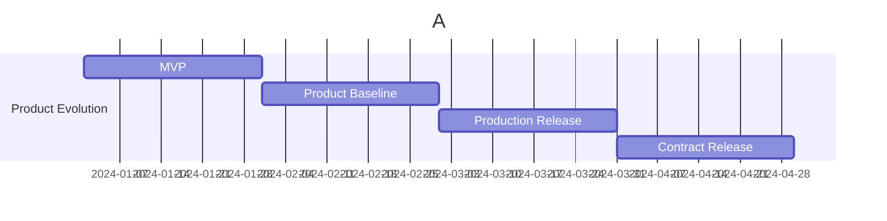

## Metadata

- **Project**: <name-of-project>
- **Status**: <Draft-In Progress-Completed-Superseded>
- **Stage**: <discovery>
- **Owner**: <name-of-owner>
- **Last Updated**: <YYYY-MM-DD>

---

## Related Documents

- Business Problem
- Problem Discovery
- Problem Statement
- Solution Space Exploration
- Solution Concept Selection

---

# Assumptions Backlog

## Purpose
- Select assumptions from the list of assumptions to focus on first with the highest combination of:
  - Importance
  - Uncertainty
  - Risk if Wrong 
- Select the best validation approach (tool) to validate the citical assumptions.

## Assumptions Backlog
Use `ART-XXX-assumption-list.md` to create the assumptions backlog and prioritize the assumptions based on their importance and evidence level.

**Priority** = `Impact (Importance)` × `Uncertainty (Evidence)` × `Consequence (Risk if Wrong)`

**Validation Strategies:**
- Interview users
- Survey
- Prototype
- Wizard of Oz
- Concierge test
- Technical spike
- Build & Observe
- Analytics
- A/B test
- MVP

**Validation Strategy Usage in %:** [Link](#validation-strategy-usage)

**MVP Related rules** 
- if assumption is (Yes or Maybe) MVP != automatically means `Build & Observe` as validation strategy. Choose appropriate validation strategy.
- if assumption is (No) MVP != automatically means `Don't validate`. Choose appropriate validation strategy.

### Backlog Table

| Assumption ID | Type | Description | Priority | Validation Strategy | Tool ID | Reason for Selection | MVP Related |
| --- | --- | --- | --- | --- | --- | --- | --- |
| AS-XXX | User | What is the belief that you have about this uncertainty? | TBD | See Validation Strategy Types | ART-XXX-survey (TBD hyperlink) | TBD | <Yes/Maybe/No> |

## Select Best Validation Approach (Tool)
Populate table in section `Assumptions Backlog` with the best validation approach (tool) to validate the critical assumptions. Use tool selection steps from the [Discovery Guide](../../../project-governance/product-discovery/discovery-guide.md#3-tool-selection-heuristic) section 3 `Tool Selection Heuristic` to help you choose the right technique.

## References
- <!--[Discovery Guide](path-to-guide)-->
- Issue <!--e.g. #125-->
- PR <!--e.g. #220-->
- <!--[Problem Discovery Guide Simple](path-to-guide)-->

## Next Steps
1. Use `Assumption backlog` as input to create `Experiments backlog` and prioritize the experiments based on their importance and evidence level.

## Validation Strategy Usage

### For high-level problem discovery:
| Validation method                  | Typical share |
| ---------------------------------- | ------------: |
| Hypothesis → Experiment → Evidence |        60–70% |
| Existing research                  |        20–30% |
| Build & Observe                    |        10–20% |

### For day-to-day product development after you've committed to an MVP:
| Validation method                              | Typical share |
| ---------------------------------------------- | ------------: |
| Build & Observe                                |        60–80% |
| Small experiments (A/B tests, usability tests) |        10–30% |
| Research                                       |         5–15% |

### MVP is not the end of discovery. MVP is the beginning of learning from the real product.

## PRD 
[How to Write a Product Requirements Document](https://www.youtube.com/watch?v=JJzODsXsCt0)
