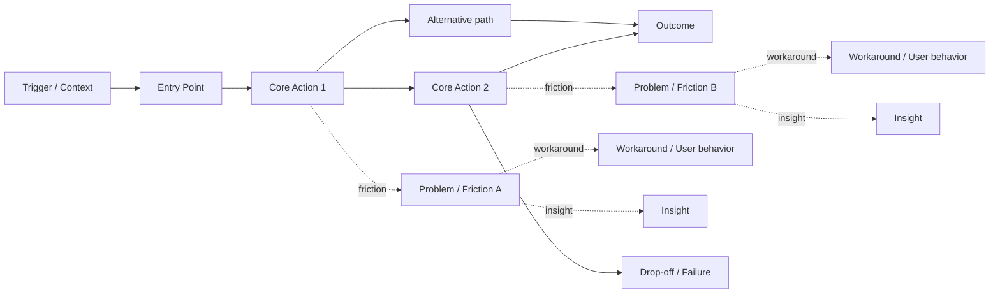

# UJR-XXX User Journey: [Name]

## Status
<!-- Options: Draft | Validated | Superseded -->

## Purpose
<!-- Why was this journey created? -->
<!-- What uncertainty or question does it help answer? -->

## User
<!-- Who is trying to get the job done? -->
<!-- Reference related JTBD or Persona if available.-->
Persona: <!--[PER-XXX-persona](<URL: github/blob/main/>)--> 

## Context
<!-- What situation triggers the need? -->

## Related Artifacts
<!-- Link supporting discovery artifacts. -->

- JTBD: <!-- [JTBD-XXX](<URL: github/blob/main/>) -->
- Persona: <!-- [PER-XXX](<URL: github/blob/main/>) -->
- Assumptions: <!-- [ASM-XXX](<URL: github/blob/main/>) -->
- Experiments: <!-- [EXP-XXX](<URL: github/blob/main/>) -->

## Journey Map

## Key Frictions
<!-- What obstacles, delays, confusion, or pain points were identified? -->

- Friction 1:
- Friction 2:

## Insights
<!-- What was learned from mapping the journey? -->

- Insight 1:
- Insight 2:

## Opportunities
<!-- Potential improvements, hypotheses, or areas for further discovery. -->

- Opportunity 1:
- Opportunity 2:

## Evidence
<!-- Supporting evidence for this journey. -->
<!--If not physical evidence artifact is not available, describe the context, observations, or data that support the journey. -->

- Interviews: <!-- with user XYZ -->
- Observations: <!-- when, where, and context of observations -->
- Analytics: <!-- relevant metrics or data points -->
- Research: <!-- studies, reports, or other research findings -->

## Related Work

- Issues: <!-- e.g. #123 -->
- PRs: <!-- e.g. #456 -->
- Decisions: <!-- e.g. PDR-001 -->