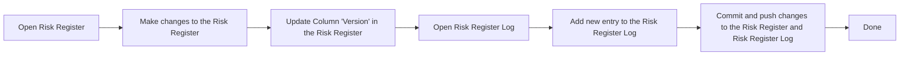

# Risk Register Log

## Purpose
The purpose of this document is to log changes made to `RSK-XXX-risks-register.ods` because `.ods` file is binary and cannot be tracked in Git.

## Process

## Risk Register Log
| Date | Risk Version | Change Description | Related Decision |Change Owner |
|------|----------------|-------------|------------|-------|  

