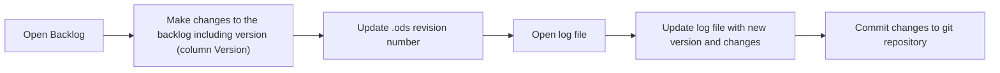

# Product Backlog Log

## Purpose
Thepurpose of this document is to log the changes made to `BL-XXX-product-backlog-[template]_v0.0.0.ods`, because  `.ods` binary files cannot be tracked in Git. This document will serve as a changelog for the product backlog.

## Process

## Log
| Date | Backlog Version | Change Description | Related Decision |Change Owner |
|------|----------------|-------------|------------|-------| 
