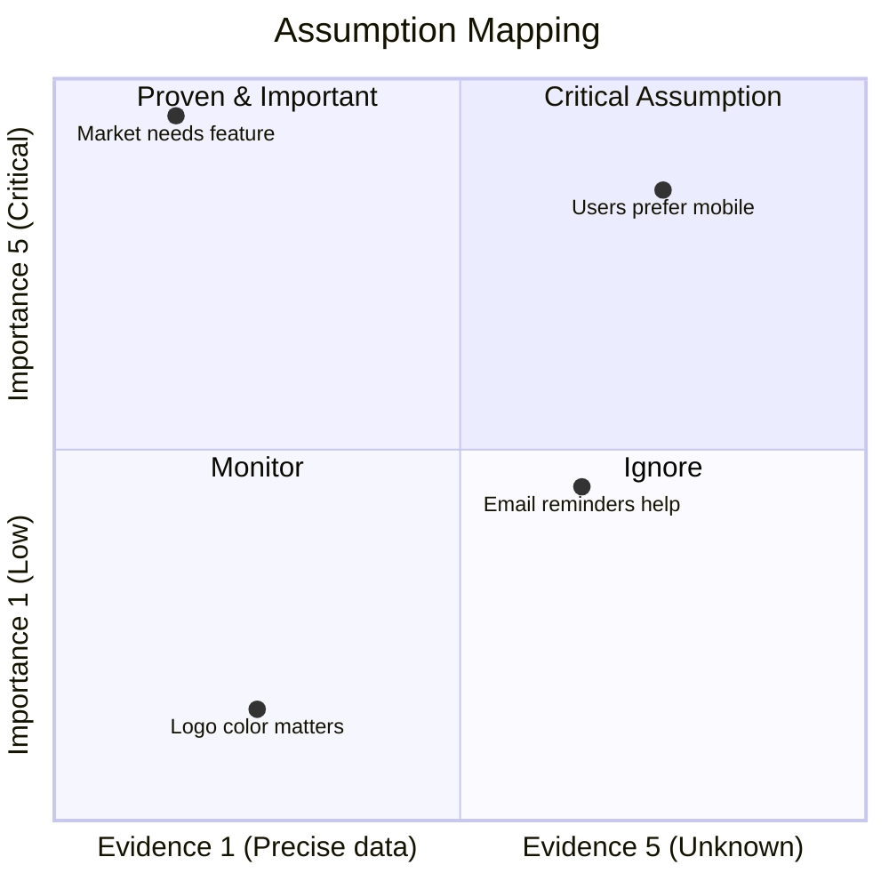

# Assumptions List

## Purpose
The purpose of this document is to capture all currently known product uncertainties and their associated assumptions and translate them into a `Assumption List` and `Assumption Mapping` to help prioritize the assumptions and identify the riskiest assumptions to focus on first.

## Assumption List

**Types to cover:**
- Desirability (Market, Users)
- Feasibility (Technology, Resources)
- Viability (Business Model, Revenue Streams)

**Uncertainties --> Assumptions:** 
What is the belief that you have about this uncertainty?

| Uncertainty | Type | Description | Importance Level | Evidence Level | Belief (Assumption) |
| --- | --- | --- | --- | --- | --- |
| Uncertainty 1 | Market | Description of uncertainty 1 | 2 | 4 | Assumption 1 |

## Assumption Mapping
Visualize with a quadrant chart to help prioritize the uncertainties.
`belief(Assumption)` + `evidence` + `importance` = `assumption mapping(prioritization)` 

Scoring:
- Importance Level:              
  - 1 - Low
  - 2 - Nice to have
  - 3 - Useful
  - 4 - Important
  - 5 - Critical
- Evidence Level:
  - 1 - Precise data
  - 2 - Limited data
  - 3 - Occasional data
  - 4 - None 
  - 5 - Unknown 

## References
- [product-discovery-guide-simple.md](#) <!--e.g. [Product Discovery Guide Simple](https://github.com/your-repo/blob/main/path-to-guide) -->
- Issue <!---e.g. #125-->
- PR <!---e.g. #220-->

## Next Steps
1. Translate the `Critical Assumptions` into `Assumption Backlog` and prioritize them in artifact `assumption-backlog.md` to focus on the riskiest assumptions first.