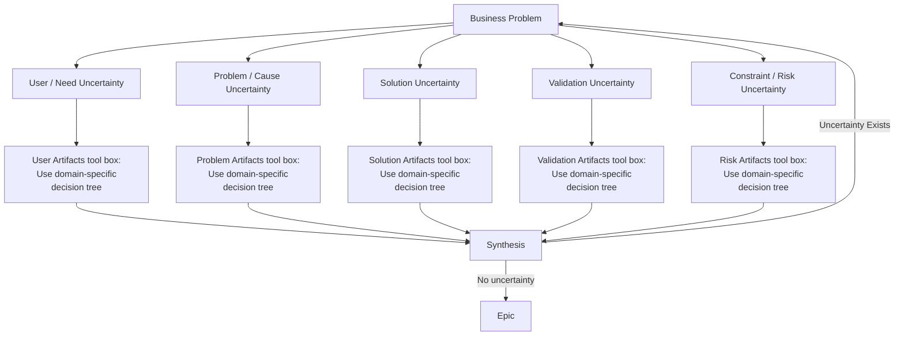
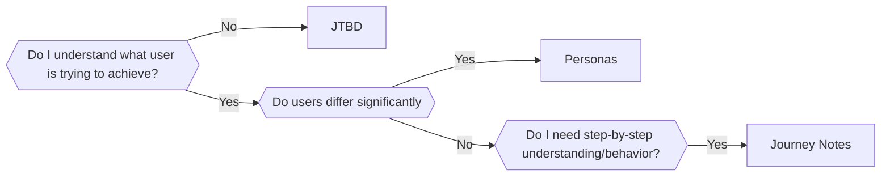
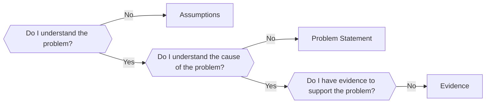
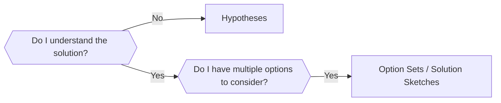
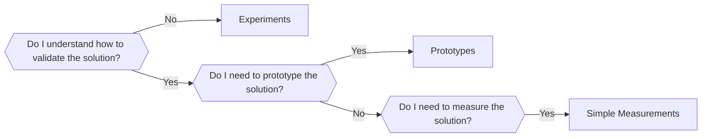
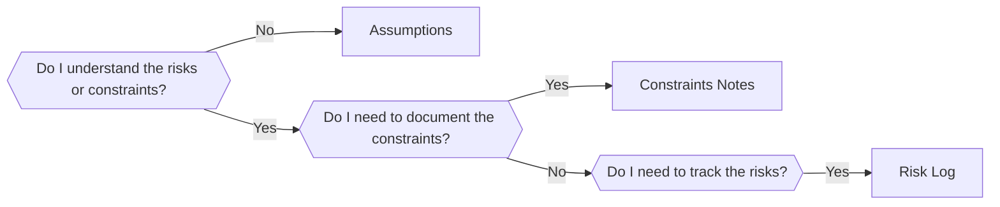
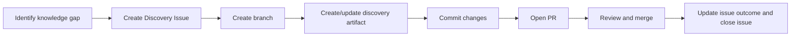

# Guidelines for Product Discovery

The simple guide to help me navigate through the product discovery process. It is a living document and will be updated as I learn more about the process. 

## ToC
1. [Product Discovery Flow](#1-product-discovery-flow)
2. [Discovery Map](#2-discovery-map)
3. [Tool Selection heuristic](#3-tool-selection-heuristic) 
    3.1 [User Domain Decision Tree](#31-user-domain-decision-tree) 
    3.2 [Problem Domain Decision Tree](#32-problem-domain-decision-tree) 
    3.3 [Solution Domain Decision Tree](#33-solution-domain-decision-tree) 
    3.4 [Validation Domain Decision Tree](#34-validation-domain-decision-tree) 
    3.5 [Risk Domain Decision Tree](#35-risk-domain-decision-tree) 
4. [Discovery Lifecycle](#4-discovery-lifecycle)

## 1. Product Discovery Flow

```mermaid
flowchart LR
   BP[Business Problem]
   A[Discovery Map] 
   B[Uncertainty Domain]
   C[Decision Tree]
   D["Artifacts (selected tools)"]
   E["Evidence / Insights"]
   F[Synthesis]
   G[Epic]
   
   BP -- Discovery identifies uncertainty --> A
   A -- Selects Uncertainty Domain --> B
   B -- Domain activates decision tree --> C
   C -- Selects suitable artifacts --> D
   D -- Produces evidence or insights --> E
   E --> F
   F -- If confidence is sufficient --> G
   F -- If uncertainty remains --> BP
```

## 2. Discovery Map
Is set of focus areas (**uncertainty domains**) for discovery work. Each area has a corresponding artifact type to capture the knowledge generated from discovery work.

Domains are not a process flow.
They are independent lenses applied based on uncertainty.

Prerequisite: Define all users
- **User** understanding stream
  - What is the user actually trying to achieve?
    - What job is the user trying to get done?
    - What triggers the need?
    - What does success look like for them?
    - What context are they in?
  - Artifacts:
    - Job To Be Done (JTBD)
    
- **Problem** validation stream
  - Why does the problem exist?
    - What is causing the friction?
    - Is this really a real problem or perception?
    - What conditions make it worse?
    - What is currently broken? 
  - Artifacts:
    - Assumptions 
    - Problem Statement
    - Evidence (data, research insights, etc.)

- **Solution** exploration stream
  - What might solve it?
    - What approaches could work?
    - What patterns exist in similar problems?
    - What constraints shape the solution space?
    - What do we believe will work?
  - Artifacts:
    - Hypotheses
    - Option sets or solution sketches

- **Validation** stream
  - How do we know it works?
    - What needs to be tested?
    - What would falsify the hypothesis?
    - What metric proves improvement?
    - What is the smallest test?
  - Artifacts:
    - Experiments
    - Prototypes
    - Simple measurements 

Prerequisite: Solution is defined and needs validation, but also low risk or high confidence
- **Risk/constraint** validation stream
  - What can breal or limit solution?
    - Technical constraints?
    -Time constraints?
    -Cost constraints?
    -Usability constraints?
    -Offline/online constraints?
  - Artifacts:
    - Assumptions
    - Constraints notes
    - Risk log (lightweight)

---

## 3. Tool Selection heuristic

### Rules:
* Artifacts are reusable across all domains.
* A domain only suggests where uncertainty is likely found, not what artifact must be used.
* If an artifact better answers the question in another domain, it should be reused instead of duplicated.
* You might only use one artifact in a domain or none or reuse artifacts across domains or skip entire domains.
* For each domain:
   - Select 1 PRIMARY artifact (most useful for current uncertainty)
   - Optionally add SUPPORTING artifacts if they increase clarity
   - Never try to fill all artifacts in a domain

---

### 3.1 User Domain Decision Tree 

- Default tool: **JTBD**
  - prefer when you don’t understand why user cares
  - prefer when you don’t understand goal or motivation
- Alternative tools:
  - **Personas**
    - prefer when multiple user types behave differently
    - prefer when behavior differs by segment
  - **Journey Notes**
    - prefer when process has multiple steps or interactions
    - prefer when you need flow understanding (before/during/after)

---

### 3.2 Problem Domain Decision Tree 

- Default tool: **Assumptions**
  - prefer when you don’t understand the problem
  - prefer when you don’t understand the cause of the problem
- Alternative tools:
  - **Problem Statement**
    - prefer when you understand the problem but not the cause
  - **Evidence**
    - prefer when you understand the problem and cause but have no evidence to support it     

### 3.3 Solution Domain Decision Tree 

- Default tool: **Hypotheses**
  - prefer when you don’t understand the solution
  - prefer when you don’t understand the options available
- Alternative tools:
  - **Option Sets / Solution Sketches**
    - prefer when you understand the solution but want to explore multiple options    

---

### 3.4 Validation Domain Decision Tree 

- Default tool: **Experiments**
  - prefer when you don’t understand how to validate the solution
  - prefer when you don’t understand how to test the solution
- Alternative tools:
  - **Prototypes**
    - prefer when you need to test the solution but can’t do it with an experiment
  - **Simple Measurements**
    - prefer when you need to measure the solution but can’t do it with an experiment 

---

### 3.5 Risk Domain Decision Tree 

- Default tool: **Assumptions**
  - prefer when you don’t understand the risks or constraints
  - prefer when you don’t understand the constraints or risks
- Alternative tools:
  - **Constraints Notes**
    - prefer when you understand the risks or constraints but need to document them
  - **Risk Log**
    - prefer when you understand the risks or constraints but need to track them      

--- 

## 4. Discovery Lifecycle

## Open topics
- missing Decision Record
- Update the guide with DR (see ChatGpt prompt)