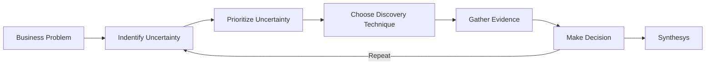
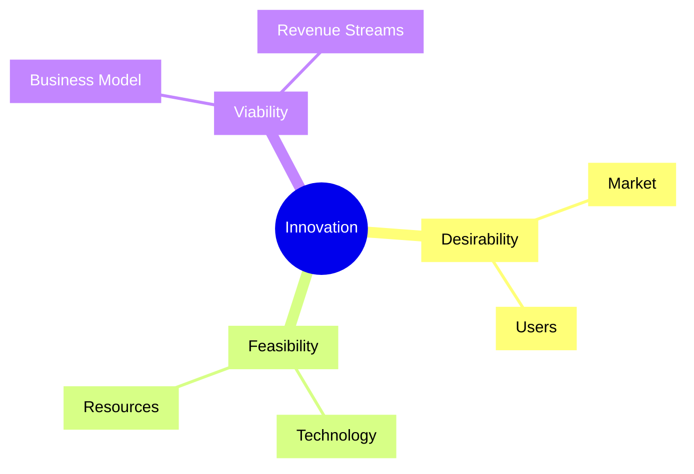
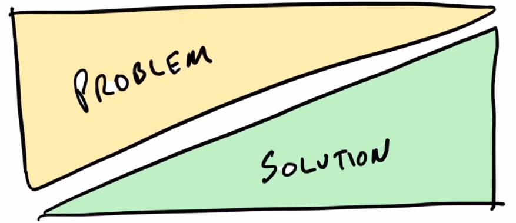
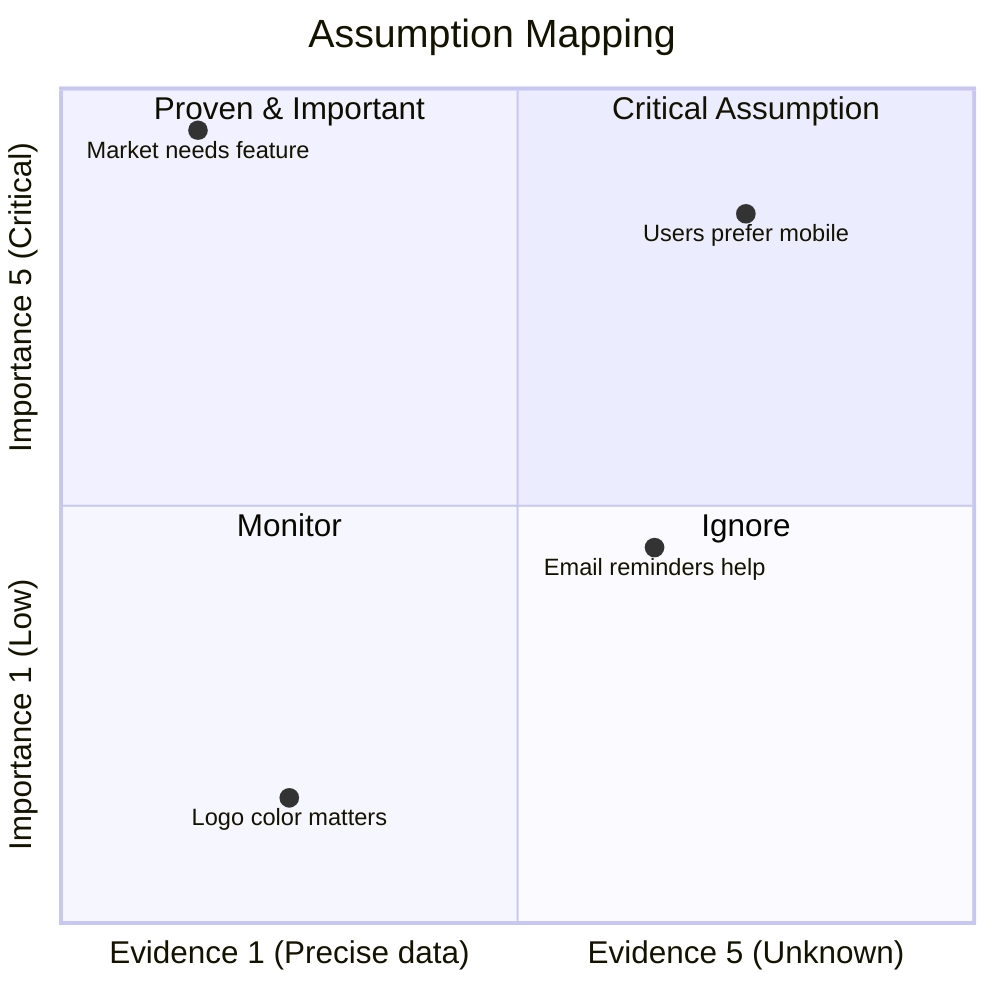
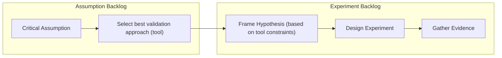
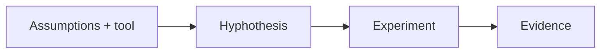
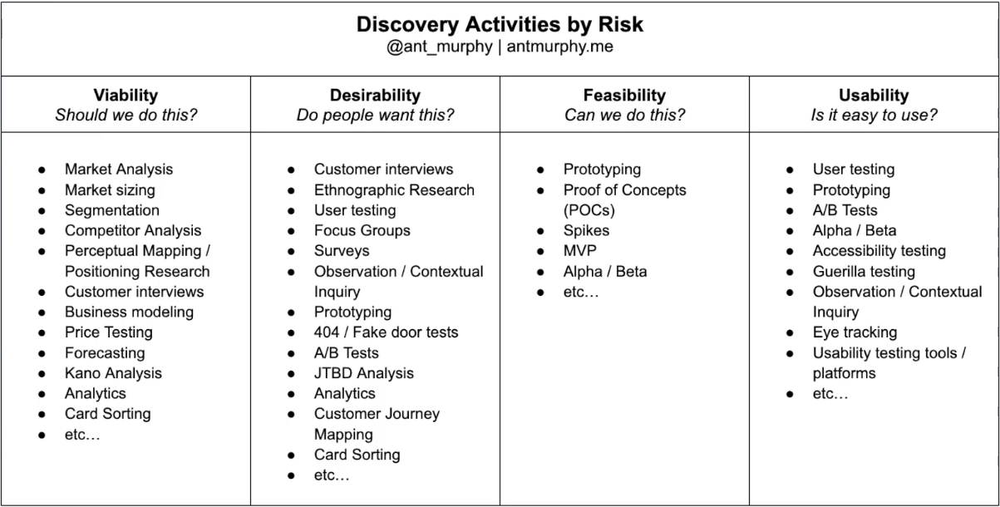

# Simplified Product Discovery Guide

## Intro
This is a simplified guide to product discovery. It is designed to help me quickly understand the key steps in the product discovery process and how to apply them in practice. 

## Product Discovery Flow


## ToC:
1. [Business Problem](#1-business-problem)
2. [Identify Uncertainty](#2-identify-uncertainty)
3. [Prioritize Uncertainty](#3-prioritize-uncertainty)
4. [Choose Discovery Technique](#4-choose-discovery-technique)
5. [Gather Evidence](#5-gather-evidence)
6. [Make Decision](#6-make-decision)
7. [Repeat](#7-repeat)
8. [Synthesys](#8-synthesys)
9. [References](#9-references)

## 1. Business Problem
Describe the business problem you are trying to solve. It should not contains any solutions or implementation details or causes. It should be a clear and concise statement of the problem that you are trying to solve. 

Ref.: [TBD](./path-to-business-problem-guide.md)

## 2. Identify Uncertainty
Take BP and identify the uncertainties that are preventing you from making a decision. 

These uncertainties can be related:
- market
- users
- technology
- business model
- other 




 
| Uncertainty | Type | Description | Importance Level | Evidence Level | Belief (Assumption) |
| --- | --- | --- | --- | --- | --- |
| Uncertainty 1 | Market | Description of uncertainty 1 | 2 | 4 | Assumption 1 |


---

**Express `uncertainties` into `beliefs(Assumptions)`**

Add a new column the the table to capture the `beliefs(Assumptions)`.

**Core Question:** What is the belief that you have about this uncertainty?

**Examples:**
- Uncertainty: Users will prefer mobile over web
- Belief: Users will prefer mobile over web because they are always on the go and want to access the product from their mobile devices.
- Uncertainty: Market needs feature X
- Belief: Market needs feature X because it will help them achieve their goals faster and more efficiently.

---

Visualize with a quadrant chart to help prioritize the uncertainties.
`belief(Assumption)` + `evidence` + `importance` = `assumption mapping(prioritization)`



Scoring:
- Importance Level:              
  - 1 - Low
  - 2 - Nice to have
  - 3 - Useful
  - 4 - Important
  - 5 - Critical
- Evidence Level:
  - 1 - Precise data
  - 2 - Limited data
  - 3 - Occasional data
  - 4 - None 
  - 5 - Unknown 

## 3. Prioritize Uncertainty



### Assuptions Backlog
- Select the most riskiest uncertainty `Importance High` and `Evidence Low` to focus on first. Create the assumptions backlog and prioritize the assumptions based on their importance and evidence level.

| Assumption | Type | Description | Priority | Tool ID | Reason for Selection |
| --- | --- | --- | --- | --- | --- |
| Assumption 1 | Market | Description of assumption 1 | 4 | JTBD-001 | Reason for tool 1 |

### Select Best Validation Approach (Tool)
- Ref [4. Choose Discovery Technique](#4-choose-discovery-technique)

**Principle:** Consider 2-3 tools to validate the assumption. Select the tool that is most appropriate for the assumption and the resources available.

---

## 4. Choose Discovery Technique
Select the most appropriate discovery technique to gather evidence for the selected assumption. The choice of technique will depend on the type of assumption and the resources available. Some common discovery techniques include:

Use tool selection steps from the [Discovery Guide](./docs/project-governance/product-discovery/discovery-guide.md#3-tool-selection-heuristic) section 3 `Tool Selection Heuristic` to help you choose the right technique.

And the tool templates:
- JTBD (Jobs to be Done)
- User Journey Mapping
- Constraints Notes   
- Option Sets
- Personas
- Problem Statements
- Risk logs
- Simple Measurement

## 5. Gather Evidence


Take the Assumption and selected tool to make a hypothesis. Then design an experiment to test the hypothesis and gather evidence.

### Experiment Backlog
| Priority | Assumption ID | Hypothesis | Experiment | Evidence | Decision | Owner| Status | Start Date | Completion Date |
| --- | --- | --- | --- | --- | --- | --- | --- | --- | --- |
| 1 | Assumption 1 | If we implement feature X, then user engagement will increase by 20% | A/B testing of feature X vs. control group | Collected data from A/B test | Decision pending | John Doe | In Progress | 2024-06-01 | 2024-06-15 |

### Create Hypothesis (tool constrained)
`Hypothesis = Assumption + Expected Outcome + Rationale`, hypothesis makes the assumption testable and measurable.

Hypothesis does not require standalone artifact if the assumption is simple and can be tested with a single experiment. However, if the assumption is complex and requires multiple experiments to test, then it is recommended to create a separate hypothesis artifact.

Add hypothesis ID `HYP-XXX` to the assumption backlog table to link the assumption with the hypothesis.

**Note:** 
- Think twice before you start an experiment. 
- Make sure you have a clear hypothesis and a well-defined experiment plan. 
- Dont over engineer the experiment. Keep it simple and focused on the key assumption you are trying to test.



- Ref.: [Hypothesis](./docs/product/discovery/templates/HYP-XXX-hypothesis-[template].md)
- Ref.: [Experiment](./docs/product/discovery/templates/EXP-XXX-experiment-[template].md)

## 6. Make Decision
Review the evidence gathered from the experiment and make a decision on whether to proceed with the solution, pivot, or abandon the idea. 

Document the decision and the rationale behind it in the [Decision Record](./docs/product/discovery/templates/PDR-XXX-product-decision-record-[template].md).

## 7. Repeat
Repeat the process for the next uncertainty in the backlog until the cost of discovering uncertainty is greater than the cost of building the solution.

## 8. Synthesis
Once you have gathered enough evidence and made decisions on the key uncertainties, synthesize the findings and document the insights in a clear and concise manner. This will help inform future decisions and provide a reference for the others.

Ref.: [Synthesis](./docs/product/discovery/templates/SYN-XXX-synthesis-[template].md)

## 9. References

- YT - CZ
Sign in
Introduction to Product Discovery (incl. a simple process to get started) --> 
[Link](https://www.youtube.com/watch?v=0UpQS_bU2dk)
    - 06:54 Derisking against 3 pillers of uncertainty
    - 07:38 Problem & Solution space (diamond)
    - 10:05 Drill down into problem & solution space
    - 19:00 Diverge and Converge
    - 23:43 Assumptions mapping
    - 26:23 Discovery backlog
    - 27:40 Assumption --> Hypothesis -- > Experiment
    - 30:51 Discovery cheat sheet
    - 33:20 Time box (version in 36:52)
    - 41:30 Loop through spaces of uncertainty
- Discovery Cheat Sheet
    - 
- Enterprise Product Discovery
   - ```mermaid
     flowchart LR
      A[Problem] --> B[System Decomposition]
      B --> C[Uncertainty] 
      C --> D[Prioritize] 
      D --> E[Technique] 
      E --> F[Evidence] 
      F --> G[Decision]
     ```
    - ```text
      Why do we need to decompose the system?
      Because in many real companies:

      - people don’t even agree on what the system is
      - the problem is not well-defined
      - different teams see different “systems”

      So decomposition becomes a safety layer.
      ```  